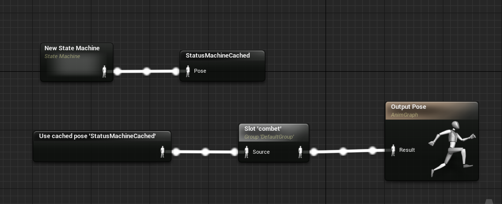
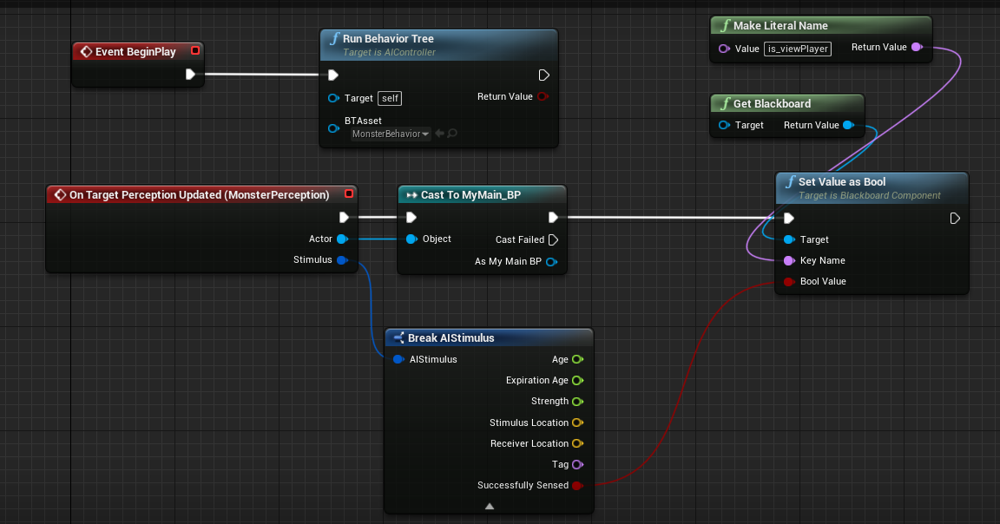
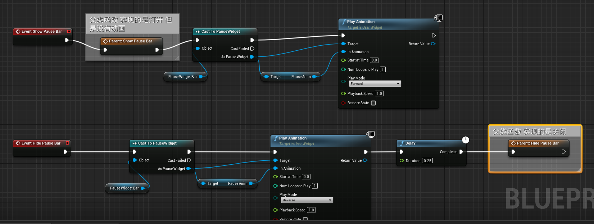

# Unreal - ReBirth
 English | [简体中文](./README-CN.md)  
 This is an independently developed game. The purpose is to get started with the virtual 4 game engine, and better compatible with BluePrint and C++ ue4 development. Let us know when to use BluePrint to develop and when to use C++ to develop Unreal 4.
 This is a very interesting thing. Of course you can:
 `git clone https://github.com/Sugar0612/ReBirth.git` or `git clone git@github.com:Sugar0612/ReBirth.git` to get the source code.

    

## Current process

This is the most recent demo when I was learning to develop with C++/BluePrint.


## Some interesting functions currently involved

Currently, C++ development is the main focus.
- Regarding the use and declaration of various components (UStaticMeshComponent, UCameraComponent, USphereComponent, UParticleSystemComponent...), they all need
  ```cpp
  CreateDefaultSubObject<class* T>(TEXT());
  ```
  To create a statement, you also need
  ```cpp
  SetupAttachment(GetComponent());
  ```
  To rely on the root component, it is worth noting that the collision component generally becomes the root component, namely:
  ```cpp
  RootComponent = CollisionComponent;
  ```

- Use and rewrite of Tick function and BeginPlay function, rewrite the general template `virtual T function() override;`

- Some mechanisms for character control: inherit APawn / ACharacter to use functions
  ```cpp
  SetupPlayerInputComponent(UInputComponent* PlayerInputComponent);
  ```
- Box collision mechanism
  ```cpp
  void T::BeginPlay() {
  /* trigger Box Bind Function */
     TriggerBox->OnComponentBeginOverlap.AddDynamic(this, &T::BeginOverlap);
     TriggerBox->OnComponentEndOverlap.AddDynamic(this, &T::EndOverlap);
  }
  ```
  Of course you also need to rewrite BeginOverlap and EndOverlap
  ```cpp
  UFUNCTION()
  void BeginOverlap(UPrimitiveComponent* OverlappedComponent, AActor* OtherActor, UPrimitiveComponent* OtherComp, int32 OtherBodyIndex, bool bFromSweep, const FHitResult& SweepResult);
  UFUNCTION()
  void EndOverlap(UPrimitiveComponent* OverlappedComponent, AActor* OtherActor, UPrimitiveComponent* OtherComp, int32 OtherBodyIndex);
  ```
- HUD window realizes what he added to the game window in my `MainPlayerController`, and set him in the game mode `Player Controller Class`.

- Animation blueprint inherit from `UAnimInstance`, define a function
  ```cpp
  UFUNCTION(BlueprintCallable, Category = Animations)
  void UpdateAnimation();
  ```
  Write some action mechanisms in it so that there are judging criteria for switching between each action. Again, use the `Event Blueprint Update Animation` to call it in the blueprint before.

- Weapon equipment is inherited from `AItem`. I asked him to provide the most basic functions for new scene objects, such as particle effects and MeshComponent. We need to add `Socket` to the character skeleton in advance. This will become the slot for weapon insertion .
  We will define the corresponding bone control to load the weapon model
  ```cpp
  /* *Weapon bone control */
  UPROPERTY(EditAnywhere, BlueprintReadWrite, Category = "Skeletal")
  class USkeletalMeshComponent* SkeletalComponent;
  ```

  After creation, we insert the weapon into the slot
  ```cpp
  void AWeapon::equipWeapon(AMain* player) {
      /* *Ignore certain types of collisions */
      SkeletalComponent->SetCollisionResponseToChannel(ECollisionChannel::ECC_Camera, ECollisionResponse::ECR_Ignore);
      SkeletalComponent->SetCollisionResponseToChannel(ECollisionChannel::ECC_Pawn, ECollisionResponse::ECR_Ignore);
      SkeletalComponent->SetSimulatePhysics(false);

      /* *Get a weapon slot */
      const USkeletalMeshSocket* WeaponSocket = player->GetMesh()->GetSocketByName("WeaponSocket");
      if (WeaponSocket) {
 
  /* *If the acquisition is successful, attach it to the slot */
      WeaponSocket->AttachActor(this, player->GetMesh());
      }
  }
  ```
- Montage animation summarizes the basic steps:
  ``
      1. Create
      2. Drag in the animation
      3. Segmentation
      4. Create slot:'combet'
  ``
  The next step is the setting of AnimInstance_BP. 
  
  Then modify the state machine according to different standards. Regarding the definition and use of Montage in C++:
  Define montage:
  ```cpp
  UPROPERTY(EditAnywhere, BlueprintReadOnly, Category = "Anims")
  class UAnimMontage* CombatMontage;
  ```
  Call the animation of different fragments:
  ```cpp
  /* *Get examples of montage */
  UAnimInstance* AnimInstance = this->GetMesh()->GetAnimInstance();
  AnimInstance->Montage_Play(CombatMontage, 1.2f);
  AnimInstance->Montage_JumpToSection(FName("NAME"), CombatMontage);
  ```

- Ai follow/auto attack Use `blackboard + behavior tree + AIContorller` to realize AI's random finding point and see the player's chasing action. Create the variables you need in the blackboard. Variables are used to make `Selector` judgments in the behavior tree. You need to change
  The variables of the blackboard are attached to different `Sequence` with the attribute `Both` to implement different `Task` (you need to go to `New Task` in the behavior tree).  In AIController, you first need to set up the Ai Perception organ `Ai Perception`
  For `AI Sight Config`, then in Blueprint:  
    
  Finally, you only need to set `AI Controller Class => AIController` in Monster_BP to achieve the action you want.
  For the triggering of the attack action, I chose to set the box collision in C++ and created the enemy's emun state:
  ```cpp
  UENUM(BlueprintType)
  enum class EMonsterState: uint8 {
          EMS_Ldle UMETA(DeplayName = "Ldle"),
          EMS_MoveToTarget UMETA(DeplayName = "MoveToPlayer"),
          EMS_Attacking UMETA(DeplayName = "Attack"),
          EMS_Default UMETA(DeplayName = "Default")
  };
  ```
  The collision box changes state:
  ```cpp
  if (OtherActor) {
      AMain* Player = Cast<AMain>(OtherActor);
      if (Player) {
         if (MonsterController) {
             bisOverlap = true;
             SetMonsterState(EMonsterState::EMS_Attacking);
         }
      }
  }
  ```
- Particle system, the particle system `ParticleSyetem` is not the particle control `ParticleSystemComponent`. The difference between them is that the particle control will always be attached, while the particle system is triggered under a certain mechanism such as collision.... The code to play the particle control system is different:
  If it¡¯s a weapon model, most of them don¡¯t have `StaticMeshComponent` but only `SkeletalMeshComponent`:
  ```cpp
  const USkeletalMeshSocket* WeaponSocket = SkeletalComponent->GetSocketByName("WeaponSocket");
  if (WeaponSocket) {
      FVector SocketLocation = WeaponSocket->GetSocketLocation(SkeletalComponent);
      UGameplayStatics::SpawnEmitterAtLocation(GetWorld(), monster->BleedParticles, SocketLocation, FRotator(0.f), false);
  }
  ```
  If it is a Monster model, I created a Socket in his hand to make him the place to trigger the particle system, because he comes with `StaticMeshComponent`:
  ```cpp
  const USkeletalMeshSocket* HandSocket = GetMesh()->GetSocketByName("BloodSocket");
  //UE_LOG(LogTemp, Warning, TEXT(" Blood Socket Begin Blood! "));
  if (HandSocket) {
     FVector SocketLocation = HandSocket->GetSocketLocation(GetMesh());
     UGameplayStatics::SpawnEmitterAtLocation(GetWorld(), player->BloodParticles, SocketLocation, FRotator(0.f), false);
  }
  ```
  I also need to declare and define the former in the construction:
  ```cpp
  SkeletalComponent = CreateDefaultSubobject<USkeletalMeshComponent>(TEXT("Skeletal Mesh"));
  SkeletalComponent->SetupAttachment(GetRootComponent());
  ```
- Transmission of attack damage. There are many ways to transmit damage from other characters, but ue4 gave us a set of our own ways of transmitting damage:
  ```cpp
  /* *Damage mechanism */
  virtual float TakeDamage(float DamageTaken, struct FDamageEvent const& DamageEvent, AController* EventInstigator, AActor* DamageCauser) override;
  ```
  You need to rewrite the `TackDamage` function:
  ```cpp
  float AMonster::TakeDamage(float DamageTaken, FDamageEvent const& DamageEvent, AController* EventInstigator, AActor* DamageCauser)
  {
      ReduceHp(DamageTaken);
      return DamageTaken;
  }
  ```
  When other characters have the function of causing damage to other characters:
  You need to create a `TSubclassOf<class T>` This is the inherent template of ue4:
  ```cpp
  TSubclassOf<UDamageType> DamageTypeClass;
  ```
  Then call him when causing damage to the character:
  ```cpp
  if (DamageTypeClass) {
    UGameplayStatics::ApplyDamage(monster, Attack_Power, nullptr, this, DamageTypeClass);
  }
  ```
  This will call `TackDamage` of the character that received the damage.
- Show the enemy's health bar. This is relatively simple. First, create a HUD and then add it to the `PlayerController` and display it in the window. The problem is how to display it directly above the enemy and have a reasonable size:
  We can obtain the enemy's coordinates and then continuously obtain new coordinates in the `Tick` overridden by the class `PlayerController`, and then convert them to the 2d coordinates of the screen for display:
  ```cpp
  if (MonsterHpBar) {
    FVector2D ScreenPosition;

    /* *Convert 3d to screen 2d coordinates */
    ProjectWorldLocationToScreen(showLocation, ScreenPosition);

    FVector2D ProgressBarSize(200.f, 25.f);

    MonsterHpBar->SetPositionInViewport(ScreenPosition);
    MonsterHpBar->SetDesiredSizeInViewport(ProgressBarSize);
  }
  ```
- Save and load the game. Need to inherit a new C++ class `USaveGame`, you can create a structure in it and let it save the current character information.
  For example like this:
  ```cpp
  USTRUCT(BlueprintType)
  struct FCharacterState {
    GENERATED_BODY()

    UPROPERTY(VisibleAnywhere, Category = "SaveGameData")
    float CurHp;

    UPROPERTY(VisibleAnywhere, Category = "SaveGameData")
    float MaxHp;

    UPROPERTY(VisibleAnywhere, Category = "SaveGameData")
    float CurEp;

    UPROPERTY(VisibleAnywhere, Category = "SaveGameData")
    float MaxEp;

    UPROPERTY(VisibleAnywhere, Category = "SaveGameData")
    int32 CoinCnt;

    UPROPERTY(VisibleAnywhere, Category = "SaveGameData")
    FVector Location;

    UPROPERTY(VisibleAnywhere, Category = "SaveGameData")
    FRotator Rotation;
  };
  ```
  So now I need to call him from `MainPlayer` and save and load information.
  You need to create new function bodies for saving and loading separately:
  ```cpp
  /* *Save game function */
  void AMain::SaveGame() {
    USaveMyGame* SaveGame = Cast<USaveMyGame>(UGameplayStatics::CreateSaveGameObject(USaveMyGame::StaticClass()));
    SaveGame->CharacterState.CurHp = CurrentHp;
    SaveGame->CharacterState.MaxHp = MaxHp;
    SaveGame->CharacterState.CurEp = CurrentEp;
    SaveGame->CharacterState.MaxEp = MaxEp;
    SaveGame->CharacterState.CoinCnt = cntCoins;
    SaveGame->CharacterState.Location = GetActorLocation();
    SaveGame->CharacterState.Rotation = GetActorRotation();

    UGameplayStatics::SaveGameToSlot(SaveGame, SaveGame->GameName, SaveGame->PlayerIndex);
  }

  /* *Load game function */
  void AMain::LoadGame(bool bLoad) {
    USaveMyGame* LoadGame = Cast<USaveMyGame>(UGameplayStatics::CreateSaveGameObject(USaveMyGame::StaticClass()));
    USaveMyGame* LoadGameInstance = Cast<USaveMyGame>(UGameplayStatics::LoadGameFromSlot(LoadGame->GameName, LoadGame->PlayerIndex)); //Load the instance
    if (LoadGameInstance == nullptr) return;

    CurrentHp = LoadGameInstance->CharacterState.CurHp;
    MaxHp = LoadGameInstance->CharacterState.MaxHp;
    CurrentEp = LoadGameInstance->CharacterState.CurEp;
    MaxEp = LoadGameInstance->CharacterState.MaxEp;
    cntCoins = LoadGameInstance->CharacterState.CoinCnt;

    //To enter a new level, there is no need to load the position and rotation angle of the previous level!
    if (bLoad) {
        SetActorLocation(LoadGameInstance->CharacterState.Location);
        SetActorRotation(LoadGameInstance->CharacterState.Rotation);
    }
  }
  ```

- Pause the window. Like the previous HUD windows, they are all set in `PlayerController`. The difference is how to display the HUD window more beautifully is very important. You can design its animation in the HUD blueprint class and implement it in `PlayController` At the same time the window is opened/closed, the HUD animation is called.  
  The difference is that C++ implemented functions are called in the blueprint (but called events in the blueprint). We want to implement different functions, so we must add `_Implementation` at the end of the C++ function in the `.cpp` file to achieve an effect similar to the rewriting of the parent class. Of course, you also need to implement the call of the parent class in the blueprint.  
   
  The following is about the interaction and hiding of the mouse, it is very simple and not too much description:  

  ```cpp
  /* *Open mouse interaction */
  FInputModeGameAndUI InputModeGameAndUI;
  SetInputMode(InputModeGameAndUI);

  /* *Display mouse */
  bShowMouseCursor = true;

  /* *Turn off mouse interaction */
  FInputModeGameOnly InputModeGameOnly;
  SetInputMode(InputModeGameOnly);

  /* *Turn off the mouse */
  bShowMouseCursor = false;
  ```

- Level transfer. The principle is very simple. You need to create a class `LevenSend` that inherits `AActor`, create a `UBoxComponent` in the class, let the box detect collision and call the function and switch the level.
  ```cpp
  void AMain::SwitchLeven(FName nextLeven)
  {
    UWorld* world = GetWorld();
    FString curName = world->GetMapName();
    FName CurrentName(curName);
    if (CurrentName != nextLeven) {
      UGameplayStatics::OpenLevel(world, nextLeven);
    }
  }
  ```
  Need to pass in a `FName` which is the name of the next level, then we need to create a `FName` in `LevenSend` and let him customize it in the blueprint.
- Cutscenes. This is more troublesome to talk about, and there is no good way to express it. It is easier to learn directly by watching the video.
  [Clipscenes](https://search.bilibili.com/all?keyword=ue4%E8%BF%87%E5%9C%BA%E5%8A%A8%E7%94%BB&from_source=webtop_search&spm_id_from=333.1007)
## Learning and Communication

